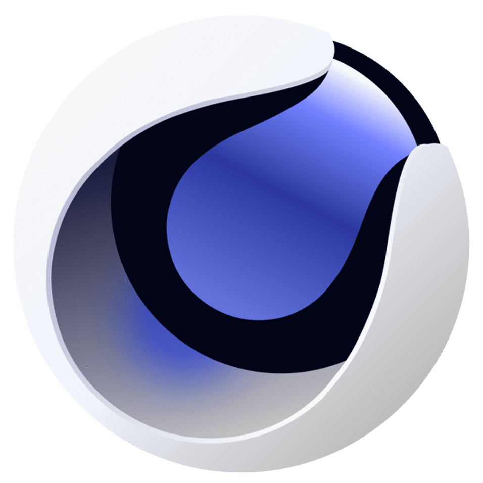

# Portfolio_Ramona_Lozon
the repository for my portfolio

Table of Contents
About
Skills
Web Design
Front End web Development
Back End web Development

Languages
HTML5
CSS
Javascript

Technologies
SASS
Greensock

Features

# Ramona Lozon's Portfolio
### Welcome to my portfolio! this is a website made to show off what im capable of.

# Table of Contents
##[About](#about) 
##[Installation](#installation) 
##[Languages](#languages-used) 
##[Technologies](#technologies) 
##[Features](#features) 
##[License](#license) 

# About this site
this is my personal portfolio i built as part of the Interactive MEdia Design Course at Fanshawe.

# Installation
to view the site properly, you'll need WAMP or MAMP server installed. open up MySQL and create a new database called "portfolio_case_file". from there look inside the 'Assets' directory of this site and you will find an SQL file known as 'portfolio_case_file.sql'. import that into the database you just made it it will set up the database for my website. from there open my site on any browser using this url: "http://localhost/Portfolio_ramona_lozon/index.php#"

# Languages Used
 HTML5

 CSS

 Javascript

# Technologies
 SASS

 Cinema 4d

# Features
### Model-Viewer
an interactive 3-d model of the earbuds with hotspots that display additional information when hovered over with your cursor, built using Model-Viewer.

# License
this repository uses the MIT License
