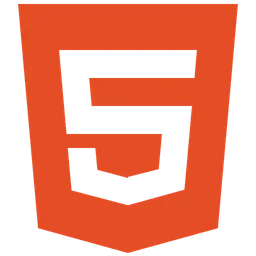
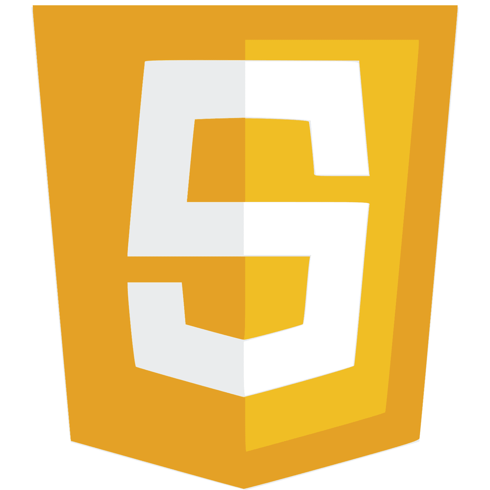
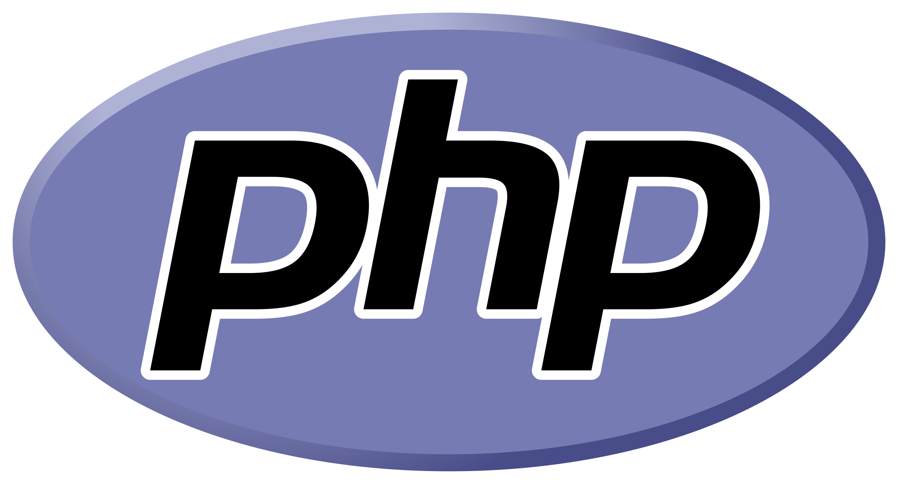
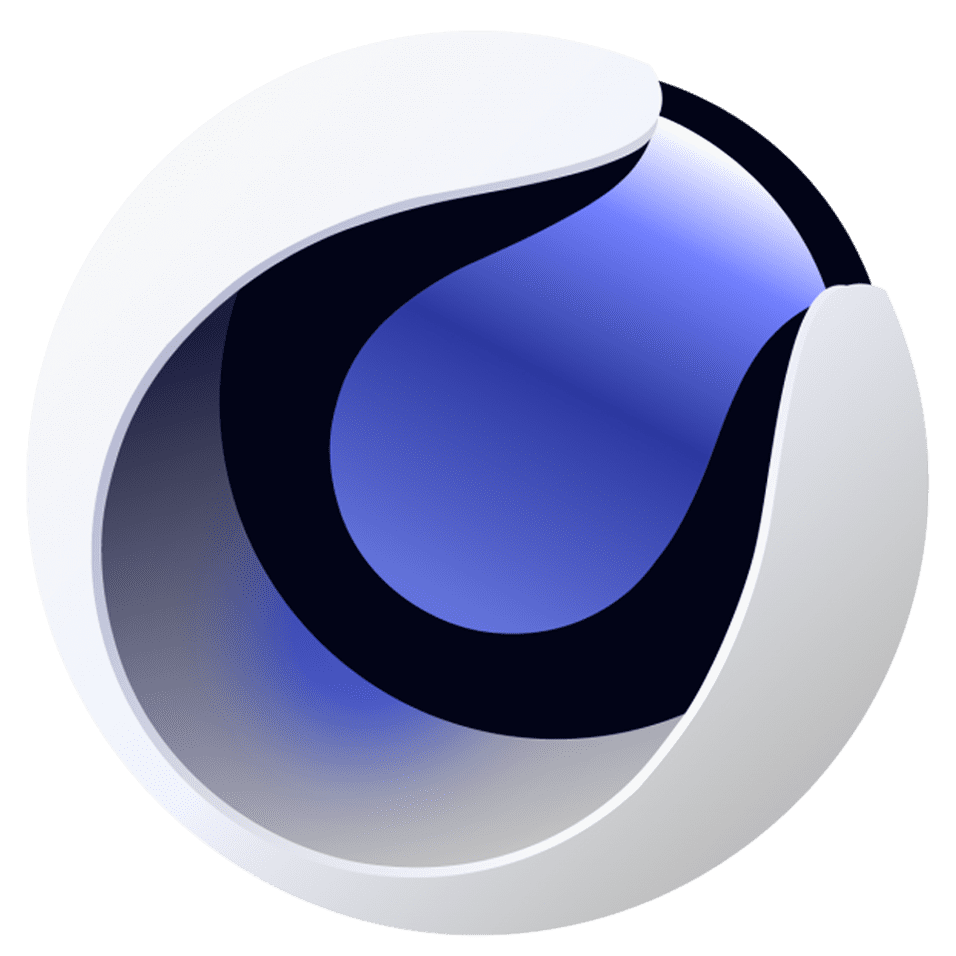
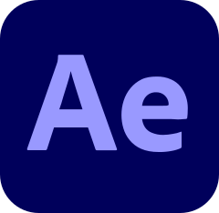

# Portfolio_Ramona_Lozon
the repository for my portfolio

Table of Contents
About
Skills
Web Design
Front End web Development
Back End web Development

Languages
HTML5
CSS
Javascript

Technologies
SASS
Greensock

Features

# Ramona Lozon's Portfolio
### Welcome to my portfolio!

# Table of Contents
##[About](#about) 
##[Installation](#installation) 
##[Languages](#languages-used) 
##[Technologies](#technologies) 
##[License](#license) 

# About this site
this is my personal portfolio i built as part of the Interactive Media Design Course at Fanshawe.

# Installation
Be sure to clone this repo into your HTDOCs (Mac) or WWW (Windows) in order to be able to view it locally

after downloading it, open terminal or Gitbash and navigate to the project directory. you may have to install homebrew if you are working on a mac in order to install many of these dependancies so be sure to do so.

when using homebrew, be sure to add brew before many installation commands, here is a list of commands that you'll want to use:

brew install php brew install composer brew install node

run this command to install php dependancies: composer install

run this command to install node: npm install

Next you will have to Generate a local .env file and generate an App_Key

command to generate .env file: cp .env.example .env or copy .env.example .env on windows command

a note for apple/mac users: you will need to enter you .env file and change some details in order to connect. If you are on Mac be sure to update your password (standard is "root") and change your "DB_PORT" value from "3306" to "8889".

Command to generate App Key: php artisan key:generate

in order to enable some of the CMS functionality you need to give Laravel approval to store files and data, enter this into your terminal or Gitbash window:

php artisan storage:link

next you will need to create a local instance of the database, run these commands in terminal/bash:

make a local database called "london_aircraft_museum"

you can do this in gitbash by running: mysql -u root -p

once in MySQL run this: CREATE DATABASE london_aircraft_museum;

Create Database tables: php artisan migrate

Fill Tables with Data: php artisan db:seed

once you have the database made you can now view the Website!

Open 2 Bash/Terminal windows in the project directory and run these commands;

in the first window start the Laravel server: php artisan serve

in the second window start the Node server: npm run dev

now you can visit: http://localhost:8000/home

# Languages Used
 HTML5

 CSS

 Javascript

PHP

# Technologies
 SASS

 Cinema 4d

 Greensock

 Adobe After Effects

# License
this repository uses the MIT License
